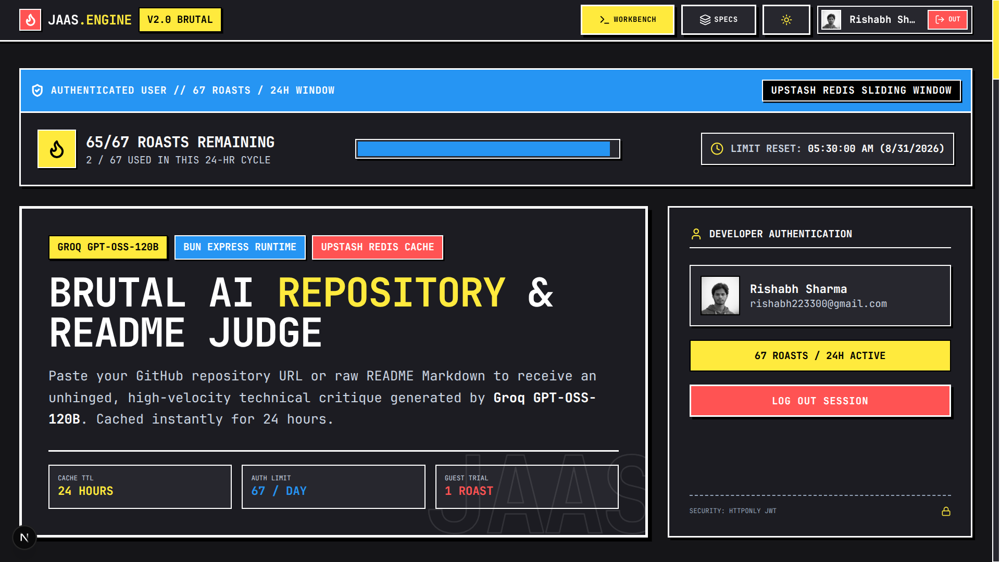
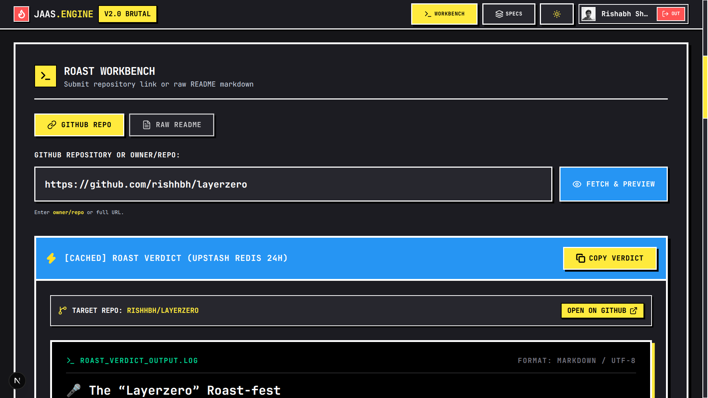
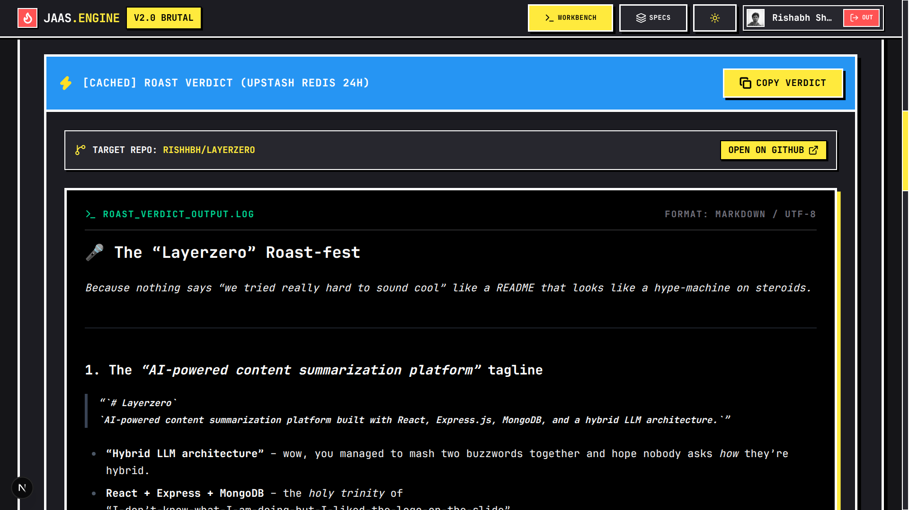
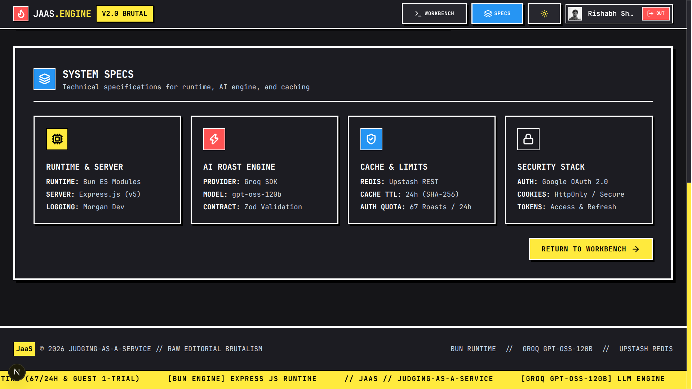
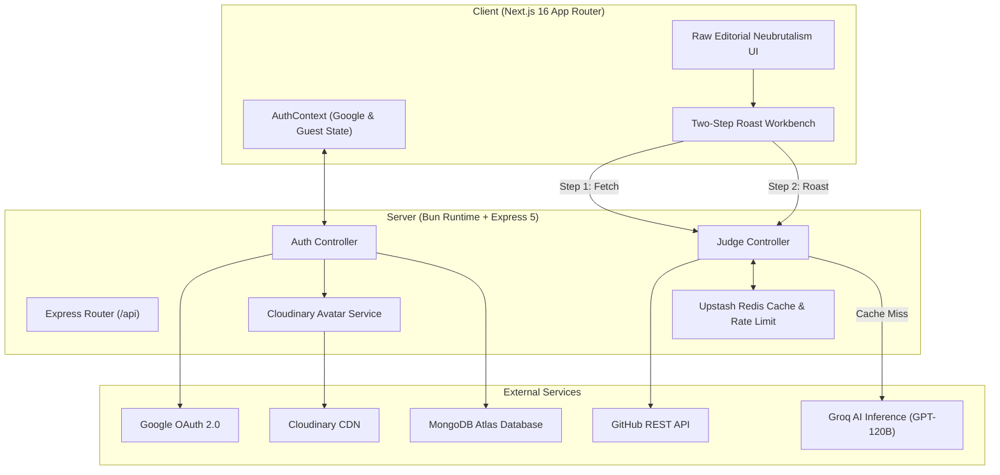

# JaaS // Judging-as-a-Service

> **Raw Editorial Neubrutalism AI Repository Evaluation Engine**  
> High-velocity technical critique platform powered by **Groq AI (GPT-OSS-120B)**, **Bun + Express**, **Upstash Redis**, **MongoDB**, **Google OAuth 2.0**, and **Cloudinary**.

<p align="center">
  
</p>

---

## Overview

**JaaS (Judging-as-a-Service)** is an unhinged, high-performance automated code critique platform. Developers can submit any public GitHub repository link or raw README markdown file to receive an instant, technical analysis covering code quality, architecture, technical debt, and README documentation completeness.

Built with a **Raw Editorial Neubrutalism** design philosophy (0px border-radius, high-contrast monochrome tones with primary neon accents, hard 3px–6px geometric shadows, and JetBrains Mono typography).

---

## Visual Showcase

<table width="100%">
  <tr>
    <td width="50%" align="center">
      <strong>1. Platform Home & Landing View</strong><br/><br/>
      
    </td>
    <td width="50%" align="center">
      <strong>2. Two-Step Fetch & Roast Workbench</strong><br/><br/>
      
    </td>
  </tr>
  <tr>
    <td width="50%" align="center">
      <strong>3. AI Roast Evaluation Output</strong><br/><br/>
      
    </td>
    <td width="50%" align="center">
      <strong>4. System Architecture & Tech Specs</strong><br/><br/>
      
    </td>
  </tr>
</table>

---

## Architecture Diagram



---

## Key Features

- **Raw Editorial Neubrutalism Design System**: Strict 0px border-radius, hard-offset black geometric shadows, high-contrast palette, and JetBrains Mono typography.
- **Two-Step Fetch & Roast Pipeline**:
  - **Step 1 (Fetch)**: Extracts raw repository README markdown, star count, branch information, and owner details via GitHub API.
  - **Step 2 (Roast)**: Evaluates repository structure through Groq AI (`openai/gpt-oss-120b`).
- **Multi-Tier Upstash Redis Rate Limiting**:
  - **Guest Mode**: Limited to 1 roast generation per 24-hour sliding window.
  - **Authenticated Mode**: Unlocks 67 roasts per 24-hour sliding window.
- **24-Hour AI Response Caching**: Upstash Redis key-value caching prevents duplicate AI inference calls for identical repositories within a 24-hour window.
- **Google OAuth 2.0 & Cloudinary Avatars**: Instant one-tap Google authentication with automated face-centered avatar uploads to Cloudinary CDN.
- **Containerized Production Setup**: Multi-stage Alpine Bun Dockerfile and root `docker-compose.yml`.
- **Complete SEO Suite**: Built-in OpenGraph generator (`/og-image.png`), Dynamic Sitemap (`/sitemap.xml`), Robots rules (`/robots.txt`), PWA Manifest (`/site.webmanifest`), and Schema.org JSON-LD structured data.

---

## Repository Structure

```
jaas/
├── client/                     # Next.js 16 App Router Frontend
│   ├── public/                 # Static assets (jaas.png, og-image.png, site.webmanifest)
│   ├── src/
│   │   ├── app/                # App Router pages (layout.tsx, page.tsx, globals.css, sitemap.ts, robots.ts)
│   │   ├── components/         # Neubrutalist UI components (RoastForm, RoastOutput, RateLimitIndicator)
│   │   └── context/            # AuthContext state provider
│   └── package.json
│
├── server/                     # Express 5 Backend running on Bun Runtime
│   ├── src/
│   │   ├── config/             # Database, Redis, and Google Auth configuration
│   │   ├── controllers/        # Auth and Judge controllers
│   │   ├── middlewares/        # Authentication and Rate Limiting middlewares
│   │   ├── models/             # Mongoose User model schema
│   │   ├── routes/             # Express API routes
│   │   └── services/           # GitHub API, Groq AI, Redis, and Cloudinary services
│   ├── app.js                  # Express application setup
│   ├── server.js               # Entry point
│   ├── Dockerfile              # Multi-stage Bun Alpine Dockerfile
│   └── package.json
│
├── docker-compose.yml          # Docker Compose orchestration config
└── README.md
```

---

## API Endpoints

### 1. Health Check
- `GET /`
  - **Response**: `200 OK`
  ```json
  {
    "status": "OK",
    "service": "Judging-as-a-Service API",
    "uptime": 245.12,
    "timestamp": "2026-08-30T15:30:00.000Z"
  }
  ```

### 2. Authentication
- `POST /api/auth/google`
  - **Description**: Authenticates user via Google OAuth ID token, uploads avatar to Cloudinary, and issues HTTP-Only JWT tokens.
  - **Body**: `{ "credential": "<GOOGLE_ID_TOKEN>" }`
  - **Response**: `200 OK`
  ```json
  {
    "success": true,
    "message": "Logged in successfully",
    "user": {
      "id": "66d1f...",
      "name": "Developer Name",
      "email": "dev@example.com",
      "avatar": "https://res.cloudinary.com/.../avatar_dev.jpg",
      "isGuest": false
    }
  }
  ```

### 3. Repository Evaluation (Judge)
- `POST /api/judge/fetch`
  - **Description**: Fetches public repository metadata and raw README content from GitHub.
  - **Body**: `{ "repoUrl": "owner/repo" }`

- `POST /api/judge/roast`
  - **Description**: Submits README content or GitHub repository to Groq AI inference engine. Checks Redis cache first.
  - **Body**: `{ "repoUrl": "owner/repo", "readmeText": "# Readme...", "model": "openai/gpt-oss-120b" }`

- `GET /api/judge/rate-limit`
  - **Description**: Returns current sliding window rate limit status for guest or authenticated IP/user.

- `GET /api/judge/models`
  - **Description**: Returns supported AI inference models.

---

## Environment Variables

### Server Environment (`server/.env`)

```env
PORT=5000
MONGO_URI=mongodb+srv://<user>:<password>@cluster.mongodb.net/jaas
CLIENT_URL=http://localhost:3000
GOOGLE_CLIENT_ID=your_google_client_id_here
ACCESS_TOKEN_SECRET=your_access_token_secret_here
REFRESH_TOKEN_SECRET=your_refresh_token_secret_here
GROQ_API_KEY=your_groq_api_key_here
GROQ_MODEL=openai/gpt-oss-120b
NODE_ENV=development
UPSTASH_REDIS_REST_URL=https://your-upstash-redis-url.upstash.io
UPSTASH_REDIS_REST_TOKEN=your_upstash_redis_token_here
CLOUDINARY_CLOUD_NAME=your_cloudinary_cloud_name
CLOUDINARY_API_KEY=your_cloudinary_api_key
CLOUDINARY_API_SECRET=your_cloudinary_api_secret
```

### Client Environment (`client/.env`)

```env
NEXT_PUBLIC_API_URL=http://localhost:5000
NEXT_PUBLIC_GOOGLE_CLIENT_ID=your_google_client_id_here
NEXT_PUBLIC_APP_URL=http://localhost:3000
```

---

## Local Development Setup

### Prerequisites
- [Bun](https://bun.sh) (v1.0+)
- [Node.js](https://nodejs.org) (v18+)
- [Docker](https://www.docker.com/) (Optional, for containerized run)

### 1. Backend Setup (`/server`)

```bash
cd server
bun install
bun run dev
```

### 2. Frontend Setup (`/client`)

```bash
cd client
npm install
npm run dev
```

Open [http://localhost:3000](http://localhost:3000) in your browser.

---

## Docker Deployment

Build and run the backend container using Docker Compose:

```bash
# Build Docker image
docker build -t jaas-backend ./server

# Run using Docker Compose
docker compose up -d
```

---

## License

ISC License. Built for developers by JaaS Engineering.
