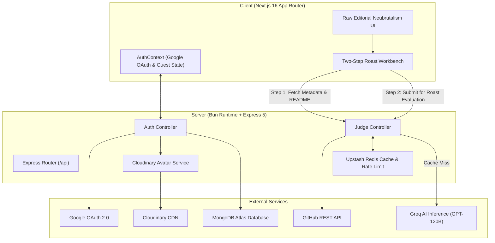

# JaaS // Judging-as-a-Service

> **Raw Editorial Neubrutalism AI Repository Evaluation Engine**  
> High-velocity technical critique platform powered by **Groq AI (GPT-OSS-120B)**, **Bun + Express**, **Upstash Redis**, **MongoDB**, **Google OAuth 2.0**, and **Cloudinary**.

<p align="center">
  
</p>

---

## Why JaaS?

### Problem Statement
Modern software development repositories are saturated with exaggerated marketing fluff. README files frequently claim to be "blazing-fast," "revolutionary," "next-gen," and "enterprise-grade," while completely failing to answer basic developer questions: What does this project actually do? How do I set it up without breaking my environment? What architectural trade-offs were made?

Documentation has mutated into corporate fan fiction. Developers waste time deciphering vague setup instructions, hunting for missing environment configurations, and navigating bloated badge clouds.

### Core Rationale & Vision
**JaaS (Judging-as-a-Service)** was created to bring accountability, clarity, and uncompromising technical evaluation back to software documentation.

1. **Objective AI Courtroom**: JaaS functions as an automated technical judge. It analyzes public GitHub repository README documentation using high-reasoning LLMs, dissecting claims, detecting buzzword inflation, and evaluating setup usability.
2. **Constructive Technical Roasts**: Criticism is delivered through a dry, senior staff engineer courtroom persona. The roasts highlight documentation debt, vagueness, and marketing hyperbole while maintaining technical accuracy.
3. **Zero-Bullshit Visual Philosophy**: The user interface matches the philosophy of the platform. Built with a Raw Editorial Neubrutalism design system, it rejects soft gradients and rounded corners in favor of 0px sharp geometry, hard 4px drop shadows, high-contrast monochrome tones, and JetBrains Mono typography.

---

## Architectural Decisions & Engineering Rationale

Every technical choice in JaaS was made to maximize execution velocity, inference throughput, operational cost-efficiency, and visual clarity.

### 1. Backend Runtime: Bun (v1.0+) + Express 5
- **Why Bun over Node.js?**
  - **Native ESM & TypeScript Execution**: Eliminates complex build/transpilation steps for server scripts, allowing instant cold starts and simplified containerization.
  - **High-Performance HTTP Parsing**: Bun's native C++ HTTP server foundation delivers up to 4x higher throughput for concurrent API requests compared to standard Node.js runtime engines.
  - **Low Memory Overhead**: Ideal for containerized environments running on resource-constrained micro-instances (e.g., Render free tier or Docker containers).
- **Why Express 5?**
  - Standardized, battle-tested middleware routing pipeline for authentication, rate limiting, validation schemas, and error handling.

### 2. AI Inference Engine: Groq AI (`openai/gpt-oss-120b`)
- **Why Groq LPU (Language Processing Unit) Architecture?**
  - **Sub-Second Latency**: Traditional cloud LLM APIs take 10 to 20 seconds to process complex 2,000-word prompt contexts and generate multi-section markdown reports. Groq LPUs execute inference for 120B parameter models in under 2 seconds.
- **Why `openai/gpt-oss-120b`?**
  - Superior structured text reasoning and strict instruction-following capacity.
  - Capable of adhering to rigid courtroom output markdown schemas without breaking formatting or hallucinating claims unsupported by the target README.

### 3. Caching & Rate Limiting Layer: Upstash Redis (REST / HTTP)
- **Why Serverless Upstash Redis HTTP API?**
  - **Connectionless Execution**: Prevents TCP socket pool exhaustion and connection leak issues during serverless scale-to-zero cycles or Bun runtime restarts.
- **24-Hour AI Response Caching**:
  - Hash key caching (`jaas:roast:<repo_hash>`) stores full AI evaluations. Duplicate evaluations for identical repositories return cached results instantly (0ms latency, zero AI token cost).
- **Multi-Tier Sliding Window Rate Limiting**:
  - **Guest Tier**: Restricted to 1 roast generation per 24-hour sliding window per IP.
  - **Authenticated Tier**: Unlocks 67 roasts per 24-hour sliding window per user ID, incentivizing sign-ins while protecting backend AI quotas.

### 4. Persistence & Auth: MongoDB Atlas + Google OAuth 2.0 + HTTP-Only JWT Cookies
- **Why Google OAuth 2.0?**
  - Zero-friction one-tap developer authentication without managing password hashes or email verification pipelines.
- **Why HTTP-Only JWT Cookies?**
  - Eliminates client-side XSS token theft risks compared to storing tokens in `localStorage`.
  - Implements a dual-token lifecycle: short-lived Access Tokens for route validation and long-lived sliding Refresh Tokens for seamless session renewal.
- **Why MongoDB Atlas?**
  - Schemaless document model flexibility for storing user profiles, Cloudinary avatar metadata, rate limit state synchronization, and authentication timestamps.

### 5. Media & Avatar Processing: Cloudinary CDN
- **Why Cloudinary?**
  - Automated face detection (`g_face`), square cropping (`c_thumb`), and automatic WebP compression on user avatar URLs fetched from Google OAuth profiles.
  - Ensures ultra-fast globally cached avatar rendering across the client UI.

### 6. Frontend Stack: Next.js 16 (App Router) + Raw Editorial Neubrutalism
- **Why Next.js 16 App Router?**
  - React Server Components for optimal initial page load performance.
  - Native metadata APIs for automated dynamic OpenGraph image generation (`/og-image.png`), sitemaps (`/sitemap.xml`), robots config (`/robots.txt`), and PWA manifests (`/site.webmanifest`).
- **Why Raw Editorial Neubrutalism Design System (`client/DESIGN.md`)?**
  - **0px Corner Radius**: Every button, input, card, modal, and badge strictly enforces `rounded-none`. Zero soft rounded edges allowed.
  - **Hard Geometric Drop Shadows**: `shadow-[2px_2px_0px_#000]`, `shadow-[4px_4px_0px_#000]`, `shadow-[8px_8px_0px_#000]`. No soft blur effects.
  - **High-Contrast Monochrome & Accents**: `#0e0e10` background, `#000000` borders, `#FFEB3B` (Yellow), `#2196F3` (Blue), and `#FF5252` (Red) primary fills.
  - **Monospace Typography**: JetBrains Mono for technical metadata, badges, scorecards, and courtroom charge sheets.

---

## Visual Showcase

<table width="100%">
  <tr>
    <td width="50%" align="center">
      <strong>1. Platform Home & Landing View</strong><br/><br/>
      
    </td>
    <td width="50%" align="center">
      <strong>2. Two-Step Fetch & Roast Workbench</strong><br/><br/>
      
    </td>
  </tr>
  <tr>
    <td width="50%" align="center">
      <strong>3. AI Roast Evaluation Output</strong><br/><br/>
      
    </td>
    <td width="50%" align="center">
      <strong>4. System Architecture & Tech Specs</strong><br/><br/>
      
    </td>
  </tr>
</table>

---

## System Architecture & Data Flow



### Execution Lifecycle: Two-Step Roast Pipeline
1. **Fetch Stage (`POST /api/judge/fetch`)**:
   - Client sends target repository URL (e.g., `owner/repo`).
   - Server validates repository path and queries GitHub REST API.
   - Extracts raw `README.md` text content, star count, fork count, default branch, primary language, and owner metadata.
   - Returns structured repository overview to client workbench for user preview before triggering roast.
2. **Roast Stage (`POST /api/judge/roast`)**:
   - Server checks Upstash Redis rate limit sliding window for client IP/User ID.
   - Computes SHA-256 hash of repository path and README contents.
   - Checks Redis key `jaas:roast:<hash>`. On cache hit, instantly returns cached evaluation.
   - On cache miss, formats system prompt with courtroom persona rules and dispatches context to Groq AI (`openai/gpt-oss-120b`).
   - Groq AI generates structured markdown roast (Scorecard, Charges, Buzzword Audit, Aggravating Circumstances, Verdict).
   - Server caches result in Upstash Redis (24-hour TTL) and returns evaluation payload to client.

---

## Key Features

- **Raw Editorial Neubrutalism Design System**: Strict 0px border-radius, hard 2px–8px geometric black shadows, high-contrast palette, and JetBrains Mono typography.
- **Two-Step Fetch & Roast Pipeline**:
  - **Step 1 (Fetch)**: Extracts raw repository README markdown, star count, branch information, and owner details via GitHub API.
  - **Step 2 (Roast)**: Evaluates repository structure through Groq AI (`openai/gpt-oss-120b`).
- **Multi-Tier Upstash Redis Rate Limiting**:
  - **Guest Mode**: Limited to 1 roast generation per 24-hour sliding window.
  - **Authenticated Mode**: Unlocks 67 roasts per 24-hour sliding window.
- **24-Hour AI Response Caching**: Upstash Redis key-value caching prevents duplicate AI inference calls for identical repositories within a 24-hour window.
- **Google OAuth 2.0 & Cloudinary Avatars**: Instant one-tap Google authentication with automated face-centered avatar uploads to Cloudinary CDN.
- **Self-Roast Easter Egg Immunity**: Built-in judicial immunity evaluation for the `JaaS` repository (`rishhbh/jaas`), returning a perfect 100/100 rating.
- **Containerized Production Setup**: Multi-stage Alpine Bun Dockerfile and root `docker-compose.yml`.
- **Complete SEO & PWA Suite**: Built-in OpenGraph generator (`/og-image.png`), Dynamic Sitemap (`/sitemap.xml`), Robots rules (`/robots.txt`), PWA Manifest (`/site.webmanifest`), and Schema.org JSON-LD structured data.

---

## Repository Structure

```
jaas/
├── assets/                     # Platform screenshots and showcase media assets
├── client/                     # Next.js 16 App Router Frontend
│   ├── public/                 # Static assets (jaas.png, og-image.png, site.webmanifest)
│   ├── src/
│   │   ├── app/                # App Router pages (layout.tsx, page.tsx, globals.css, sitemap.ts, robots.ts)
│   │   ├── components/         # Neubrutalist UI components (RoastForm, RoastOutput, RateLimitIndicator)
│   │   └── context/            # AuthContext state provider
│   └── package.json
│
├── server/                     # Express 5 Backend running on Bun Runtime
│   ├── src/
│   │   ├── config/             # Database, Redis, and Google Auth configuration
│   │   ├── controllers/        # Auth and Judge controllers
│   │   ├── middlewares/        # Authentication and Rate Limiting middlewares
│   │   ├── models/             # Mongoose User model schema
│   │   ├── routes/             # Express API routes
│   │   └── services/           # GitHub API, Groq AI, Redis, and Cloudinary services
│   ├── app.js                  # Express application setup
│   ├── server.js               # Server entry point
│   ├── Dockerfile              # Multi-stage Bun Alpine Dockerfile
│   └── package.json
│
├── docker-compose.yml          # Docker Compose orchestration config
└── README.md
```

---

## API Endpoints Specification

### 1. System Health Check
- `GET /`
  - **Description**: Returns operational health status, Bun runtime uptime, and current server timestamp.
  - **Response**: `200 OK`
  ```json
  {
    "status": "OK",
    "service": "Judging-as-a-Service API",
    "uptime": 245.12,
    "timestamp": "2026-08-30T15:30:00.000Z"
  }
  ```

### 2. Authentication
- `POST /api/auth/google`
  - **Description**: Authenticates user via Google OAuth ID token, uploads face-cropped avatar to Cloudinary, and sets HTTP-Only JWT cookies.
  - **Request Body**:
    ```json
    {
      "credential": "<GOOGLE_ID_TOKEN>"
    }
    ```
  - **Response**: `200 OK`
    ```json
    {
      "success": true,
      "message": "Logged in successfully",
      "user": {
        "id": "66d1f...",
        "name": "Developer Name",
        "email": "dev@example.com",
        "avatar": "https://res.cloudinary.com/.../avatar_dev.jpg",
        "isGuest": false
      }
    }
    ```

- `GET /api/auth/me`
  - **Description**: Returns current authenticated user state from HTTP-Only JWT.

- `POST /api/auth/logout`
  - **Description**: Clears authentication cookies and invalidates session.

- `GET /api/auth/refresh`
  - **Description**: Re-issues access token using valid refresh token cookie.

### 3. Repository Evaluation (Judge)
- `POST /api/judge/fetch`
  - **Description**: Fetches public repository metadata and raw README content from GitHub REST API.
  - **Request Body**:
    ```json
    {
      "repoUrl": "owner/repo"
    }
    ```

- `POST /api/judge/roast`
  - **Description**: Submits README content or GitHub repository URL to Groq AI inference engine. Checks Redis cache first.
  - **Request Body**:
    ```json
    {
      "repoUrl": "owner/repo",
      "readmeText": "# Readme Content...",
      "model": "openai/gpt-oss-120b"
    }
    ```

- `GET /api/judge/rate-limit`
  - **Description**: Returns current sliding window rate limit status (remaining quota, reset time) for guest or authenticated IP/user.

- `GET /api/judge/models`
  - **Description**: Returns supported AI inference models.

---

## Environment Variables

### Server Configuration (`server/.env`)

```env
PORT=5000
MONGO_URI=mongodb+srv://<user>:<password>@cluster.mongodb.net/jaas
CLIENT_URL=http://localhost:3000
GOOGLE_CLIENT_ID=your_google_client_id_here
ACCESS_TOKEN_SECRET=your_access_token_secret_here
REFRESH_TOKEN_SECRET=your_refresh_token_secret_here
GROQ_API_KEY=your_groq_api_key_here
GROQ_MODEL=openai/gpt-oss-120b
NODE_ENV=development
UPSTASH_REDIS_REST_URL=https://your-upstash-redis-url.upstash.io
UPSTASH_REDIS_REST_TOKEN=your_upstash_redis_token_here
CLOUDINARY_CLOUD_NAME=your_cloudinary_cloud_name
CLOUDINARY_API_KEY=your_cloudinary_api_key
CLOUDINARY_API_SECRET=your_cloudinary_api_secret
```

### Client Configuration (`client/.env`)

```env
NEXT_PUBLIC_API_URL=http://localhost:5000
NEXT_PUBLIC_GOOGLE_CLIENT_ID=your_google_client_id_here
NEXT_PUBLIC_APP_URL=http://localhost:3000
```

---

## Local Development Setup

### Prerequisites
- [Bun](https://bun.sh) (v1.0+)
- [Node.js](https://nodejs.org) (v18+)
- [Docker](https://www.docker.com/) (Optional, for containerized run)

### 1. Backend Setup (`/server`)

```bash
cd server
bun install
bun run dev
```

### 2. Frontend Setup (`/client`)

```bash
cd client
npm install
npm run dev
```

Open [http://localhost:3000](http://localhost:3000) in your browser.

---

## Docker Deployment

Build and orchestrate the backend container using Docker Compose:

```bash
# Build backend Docker image
docker build -t jaas-backend ./server

# Launch backend container in background
docker compose up -d
```

---

## License

ISC License. Built for developers by JaaS Engineering.
